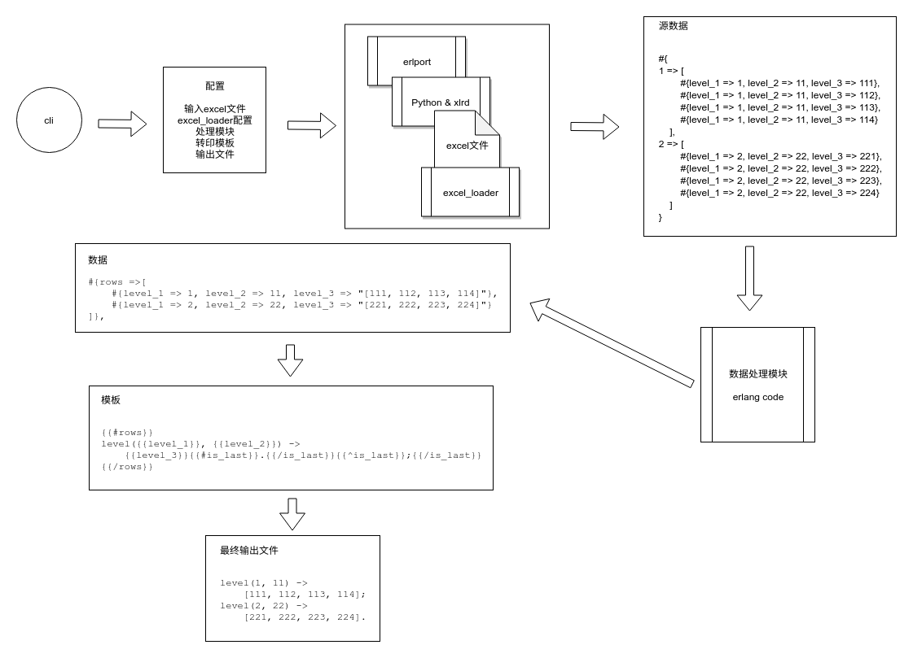
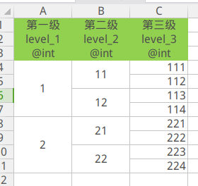

tdata
=====

专为`erlang`开发的配置生成工具



## Getting Started

* erlang
* python
* xlrd

```shell
$ pip install xlrd  
```

* rebar3
* build
``` shell
$ make es && ./tdata -h
```

## 使用说明

### 帮助文档

```shell
$ ./tdata help
Usage: tdata [-i [<input_dir>]] [-o [<output_dir>]] [-t [<template_dir>]]
             [-r [<recursive>]] [-f [<force>]] [-c <child_dir>]
             [-F [<config_file>]] [-a <app>] [-h] [-v]

  -i, --input_dir     Input directory eg: data or "data/*". [default: data]
  -o, --output_dir    Output Dir eg: output. [default: output]
  -t, --template_dir  Template directory eg: template_dir. [default: 
                      templates]
  -r, --recursive     Recursive search ChildDir of InputDir: true or 
                      false. [default: false]
  -f, --force         Force gen all output: true or false. [default: false]
  -c, --child_dir     Specify ChildDir of InputDir: '-c child_dir1 -c 
                      child_dir2 ...'
  -F, --config_file   ConfigFile eg: tdata.config. [default: tdata.config]
  -a, --app           Which application want to start.
  -h, --help          Print help.
  -v, --version       Print version.
```

### 全局配置

* `input_dir`: 指定输入目录,存放配置文件的目录
* `output_dir`: 指定输出目录,存放生成文件的目录
* `template_dir`: 指定模板目录
* `force`: 忽略时间因素强制执行
* `child_dir`: 输入目录子目录
* `config_file`: 配置文件,默认加载当前目录下的`tdata.config`配置文件
* `app`: 执行脚本需要启动的依赖应用
* `help`: 打印帮助内容
* `version`:  打印`tdata`的版本号

### 启动程序

`tdata`会自动增加`ebin`和`_build/default/lib/*/ebin`目录到`vm`加载目录;

自动启动`src`目录下的应用或者通过`--app`制定的应用;

自动遍历所有定义了`-tdata(ds).`的`数据处理模块`,然后从接口`transform_defines/0`或者`transform_defines/1`获取具体要转换的输入文件列表等.

### 编写数据处理模块

数据处理模块示例: [`getting_started.erl`](example/GettingStarted/src/getting_started.erl)

```erlang
%% 配置
transform_defines() ->
    [#{
        % 输入文件列表 & 已经加载配置
        input_file_defines => [#{file =>"config.xlsx", opts => ExcelLoaderOpts}],
        % 生成目标文件
        output_file => "src/config.erl",
        % 转换数据函数
        % transform_fun => fun only_print/1,
        transform_fun => fun transform_fun/1,
        % 模板文件
        tpl_file => "config.erl.tpl"
    }].
```

上图,我们定义了一个输入文件(`config.xlsx`),输出文件为`src/config.erl`,

转换数据方法为:`fun transform_fun/1`,模板文件为: `config.erl.tpl`

原始`excel`表格:



经过`excel_loader`转换后的数据:

```erlang
{"config.xlsx",
 #{<<"groups">> =>
       #{1 =>
             #{11 =>
                   [#{level_1 => 1,level_2 => 11,level_3 => 111},
                    #{level_1 => 1,level_2 => 11,level_3 => 112}],
               12 =>
                   [#{level_1 => 1,level_2 => 12,level_3 => 113},
                    #{level_1 => 1,level_2 => 12,level_3 => 114}]},
         2 =>
             #{21 =>
                   [#{level_1 => 2,level_2 => 21,level_3 => 221},
                    #{level_1 => 2,level_2 => 21,level_3 => 222}],
               22 =>
                   [#{level_1 => 2,level_2 => 22,level_3 => 223},
                    #{level_1 => 2,level_2 => 22,level_3 => 224}]}}
  }
}
```

处理方法示例 `fun transform_fun/1`:

```erlang
%% 转换数据
transform_fun([{_InputFile, Sheets}]) ->
    % 经过转换后的数据
    #{
        <<"类型"/utf8>> := RecordsRows,
        <<"groups">> := GroupsRows,
        <<"same_level_groups">> := SameLevelGroupsRows
    } = Sheets,
    ...
	% 转印到模板的数据
    {ok, #{records => Records, ...}}.
```

模板支持:

* [`bbmustache`](<https://github.com/soranoba/bbmustache>): [`mustache`](http://mustache.github.io/)
* [`erlydtl`](<https://github.com/erlydtl/erlydtl/wiki>): [`django`](<https://django.readthedocs.org/en/1.6.x/ref/templates/builtins.html>)

## Excel Loader 配置

配置分为两个层级

第一层层级,定义每个文件的表单(`sheet`)的列表配置:

```erlang
#{
    <<"类型"/utf8>> => SheetOpts,
    <<"groups">> => SheetOpts#{
        groups => [level_1, level_2]
    },
    <<"same_level_groups">> => SheetOpts#{
        groups => [[level_1, level_2]]
    }
}.
```

第二层级,定义每个表单(`sheet`)配置:

```erlang
#{
    skip_comments => true,
    type_comment => true,
    only_rows => true,
    ...
}
```

- `skip_comments`: 跳过N行注释, `true` 表示跳过1行,`false`表示不跳过;
- `type_comment`: 是否指定类型, 默认注释之后的第一行为类型注释,支持的类型有: `integer(int)/float/boolean(bool)/string(str)/binary(bin)/atom`,括号内的为别名,在类型前加`@`符号表示检查当前列的数据;
- `only_rows`: 返回数据时,只返回行数据,不返回额外的数据;
- `groups`: 指定合并单元格的列: 示例,如果第一列为`level_1`为合并单元格,则配置为`[level_1]`;
- `checks`: 指定每一列的检查方法或者转换函数.

具体请看[tdata_excel_loader_SUITE](test/ct/tdata_excel_loader_SUITE/tdata_excel_loader_SUITE.erl)文件


